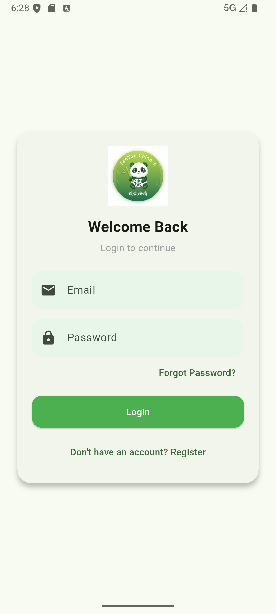
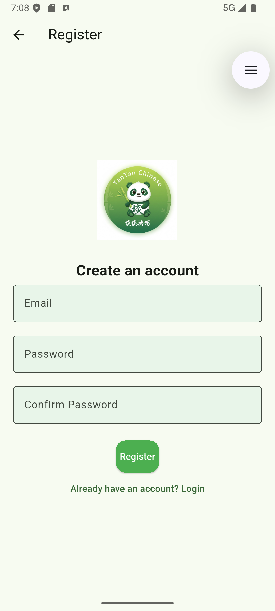
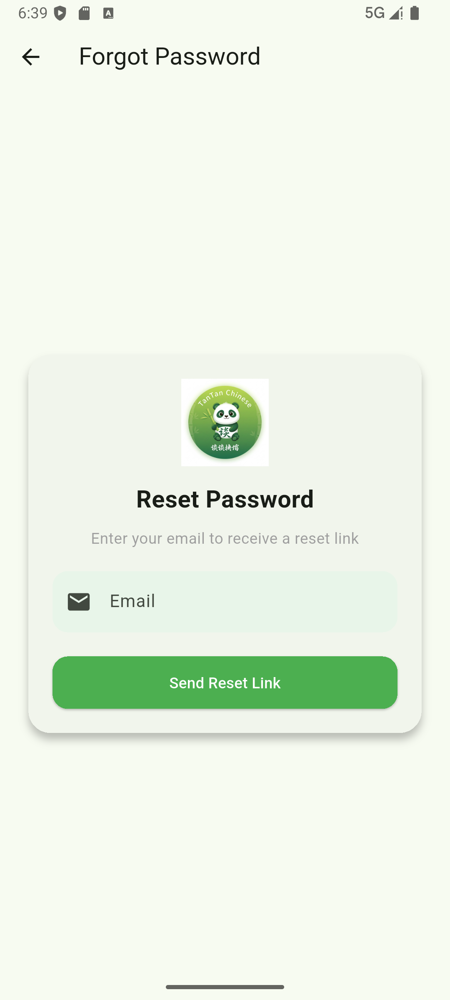

My Chinese App

A modern Flutter-based mobile application designed to help users learn the Chinese language. 
The app features a clean, professional green-themed user interface with secure authentication screens including :
- Login
- Registration
- Forgot Password.

Screenshots

Login Screen

Registration Screen

Forgot Password Screen

App Logo

